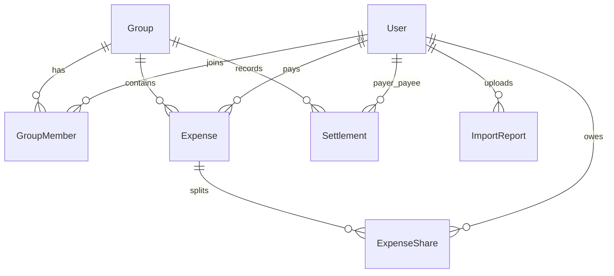

# Project Scope & Database Schema - SplitWise Expense Analyzer

This document explains the database architecture, table relationships, and the CSV import anomaly detection and handling strategy.

---

## 1. Database Schema Explanation

The application database is managed via Prisma ORM. It consists of seven core models:

### Entity Roster & Fields:
1. **User**: Represents user accounts. Stores profile details and has relationships to their paid expenses, owed shares, settlements, and uploaded import reports.
2. **Group**: Groups created or joined. Tracks group metadata and maps members, expenses, and manual settlements.
3. **GroupMember**: Junction table mapping `User` to `Group` (Many-to-Many).
4. **Expense**: Tracks individual expenses. Holds a foreign key to the paying user (`paidById`) and the group (`groupId`), and contains multiple `ExpenseShare` records.
5. **ExpenseShare**: Tracks how much each user owes for an expense. Relates a user to an expense with an `amount` and an optional `percentage`.
6. **Settlement**: Logs manual repayments between two group members (`payerId` and `payeeId`), reducing their net outstanding debts.
7. **ImportReport**: Stores CSV upload audit logs (file name, total rows, imported count, failed count, and full error logs).

---

## 2. CSV Anomaly Handling Strategy

During CSV file uploads for a group, the backend validates every row. The system processes valid rows and skips invalid ones, recording the actions in the database audit log.

### Anomaly Handling Matrix:

| Anomaly Detected | System Action | Error Log Result | Reason / Strategy |
| :--- | :--- | :--- | :--- |
| **Missing Title** | Row Skipped | `Row X: Title is required.` | An expense must have a description to identify what it was for. |
| **Missing or Negative Amount** | Row Skipped | `Row X: Amount must be a positive number.` | You cannot split an expense of $0 or negative value. |
| **Invalid Currency** | Defaulted to INR | `Defaulted to INR` (Row Imported) | If currency is not `INR` or `USD`, it defaults to `INR` to prevent import failures for minor typos. |
| **Invalid Date Format** | Defaulted to current time | (Row Imported) | Parses date. If unparseable, it defaults to the current date and imports the expense to avoid blocking the user. |
| **Empty Paid-By Email** | Row Skipped | `Row X: Paid-by email is required.` | Every expense must have an owner who paid for it. |
| **Payer Email not in Group** | Row Skipped | `Row X: Paid-by email 'xyz@email.com' is not a member of this group.` | Only group members can pay for expenses inside the group. |
| **Invalid Split Type** | Row Skipped | `Row X: Split type must be EQUAL, EXACT, or PERCENTAGE.` | The splitting math cannot be performed without a valid category strategy. |
| **Exact Split Sum Mismatch** | Row Skipped | `Row X: Sum of exact split amounts (A) does not match expense amount (B).` | The individual splits must add up exactly to the total expense amount. |
| **Percentages sum $\neq$ 100%** | Row Skipped | `Row X: Sum of percentages (90%) does not equal 100%.` | Percentage splits must cover exactly 100% of the expense. |
| **User in splits not in Group** | Row Skipped | `Row X: User 'abc@email.com' in split details is not a member of this group.` | Expenses cannot be split with people outside the active group roster. |
